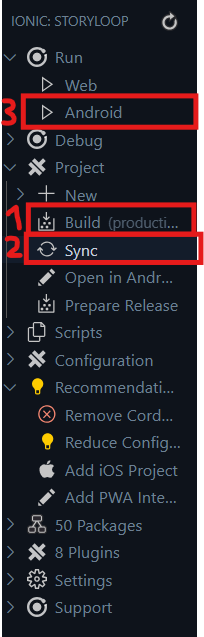

# StoryLoop

An Ionic/Capacitor app that generates text-adventure story previews based on your location.

## Prerequisites

- **Node.js** (v14 or newer)  
- **npm** (comes bundled with Node.js)  
- **Ionic CLI**  
  ```bash
  npm install -g @ionic/cli
* **Android Studio** (with Android SDK)
* **JDK 17+** (set `JAVA_HOME` to your JDK 17 install)

---

## 1. Clone & Install

```bash
git clone https://github.com/yourusername/yourrepo.git
cd yourrepo
npm install
```

---

## 2. Using the Ionic VS Code Extension

1. Open the project in VS Code
2. Install the **Ionic** extension (if you haven’t already)
3. Open the **Ionic** sidebar
4. Click **Build**
5. Click **Sync**
6. Click **Run Android**



---

## 3. (Alternative) Command-Line Workflow

If you prefer to work in the terminal, you can achieve the same:

```bash
# 1) Build the web assets
ionic build

# 2) Copy & sync into the native Android project
npx cap sync android

# 3) Launch on your connected device or emulator
#    (use `adb devices` to list available devices)
npx cap run android --target=<YOUR_DEVICE_ID>
```

> Replace `<YOUR_DEVICE_ID>` with the ID shown by `adb devices`, or omit it to pick the default device/emulator.

---

Now your `android/` folder will be updated with the latest web build, and the app will install & launch on your Android device or emulator. Happy coding!


